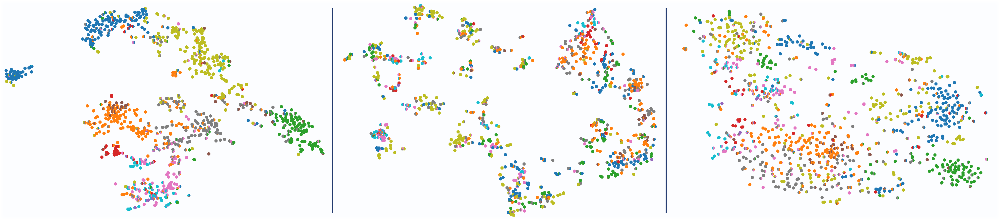
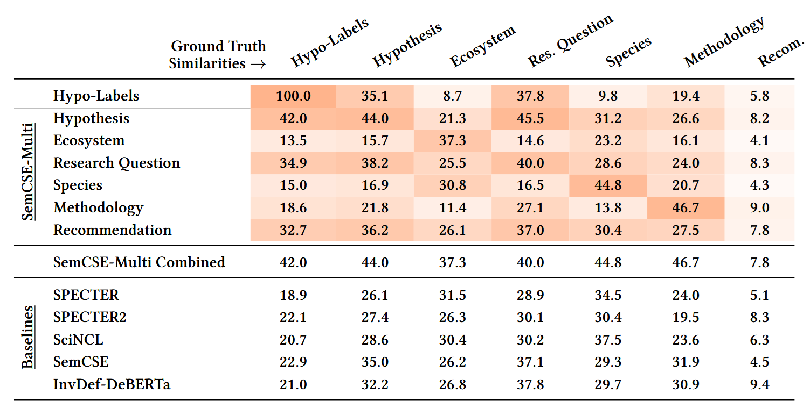

This is the official code repository for the paper:
### SemCSE-Multi: Multifaceted and Decodable Embeddings for Aspect-Specific and Interpretable Scientific Domain Mapping

We develop a pipeline for training multifaceted embedding models in the scientific domain. This means, that the embedding model outputs multiple embeddings that encode different aspects of the underlying scientific text.
In our experiments, we trained two models, one for the domain of invasion biology and one for the medical domain.
You can use the models like this:

```
# Huggingface repo ids are removed due to anonymization!
```

## Overview

We propose to train a multifaceted embedding model that produces multiple aspect-specific embeddings for a given scientific text in a single forward pass. This is done in two steps:

1. For any dataset of scientific abstracts from the target domain, we predict individual summarizing sentences for each aspect separately and train individual embedding models on these summarizing sentences to create a structured embedding space.
2. We then distill these individual aspect embedding models into a single unified model that predicts all aspect-specific embeddings at once.

We further develop a way to decode embedding space into natural language descriptions, thus making the embedding space interpretable.

## Results

The main advantages of our multi-faceted embedding approach are that the individual, aspect-specific embeddings 1) are better at capturing similarities of that aspect and 2) isolate this apsect, thus allowing for controllable similarity assessments.

Below, you see two t-SNE visualizations of the "Hypothesis" (left) and "Species" (middle) embedding spaces produced by SemCSE-Multi. They are clearly distinct, thus demonstrating that the embeddings encode the different aspects in isolation. The left image displays a baseline in the form of SciNCL, which is less distinctly structured and does not offer any control over the measure of similarity.



This is also demonstrated in our evaluation.
We compared different embedding-based pairwise similarity assessments (column 1) against ground-truth pairwise similarity scores that judge the similarity of the two underlying scientific abstracts with respect to that aspect.
We see that the embeddings for a specific aspect do correlate well with the ground-truth assessment of that same aspect. For details, please see our paper.




## Performing Experiments and Evaluations

This repository contains all necessary files for running our experiments and evaluations. This includes:
* All data that was used: Scientific abstracts (with labels), generated summaries that were used for training, and generated pariwise assessments that were used for evaluation.
* The code for generating summaries and pairwise assessments
* The code for training all models
* The code for running all evaluations

Each domain (invasion biology/medicine) has its own directory. The filenames should be self-explanatory. To see how to run the individual components, see `main.py` and comment out all unwanted steps.

### Citation

Citation is removed due to anonymization!

